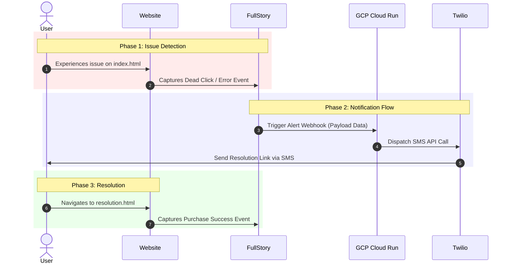

# abandon-cart
abandon cart demonstration

```mermaid
sequenceDiagram
    autonumber
    actor User
    participant Web as Website
    participant FS as FullStory
    participant CR as GCP Cloud Run
    participant TW as Twilio

    %% Step 1: Error Capture
    rect rgb(255, 235, 235)
        Note over User, FS: Phase 1: Issue Detection
        User->>Web: Experiences issue on index.html
        Web->>FS: Captures Dead Click / Error Event
    end

    %% Step 2: Automation & Alert
    rect rgb(240, 240, 255)
        Note over FS, TW: Phase 2: Notification Flow
        FS->>CR: Trigger Alert Webhook (Payload Data)
        CR->>TW: Dispatch SMS API Call
        TW->>User: Send Resolution Link via SMS
    end

    %% Step 3: Resolution Flow
    rect rgb(235, 255, 235)
        Note over User, Web: Phase 3: Resolution
        User->>Web: Navigates to resolution.html
        Web->>FS: Captures Purchase Success Event
    end
```
